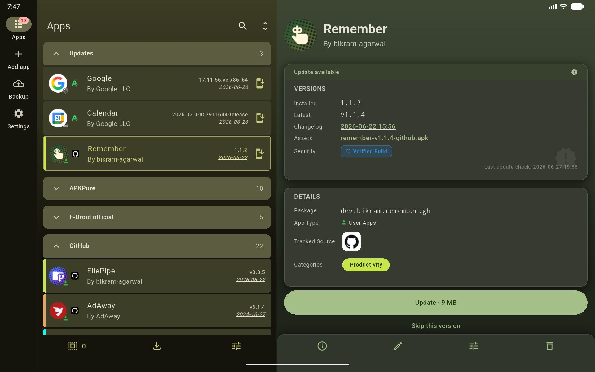
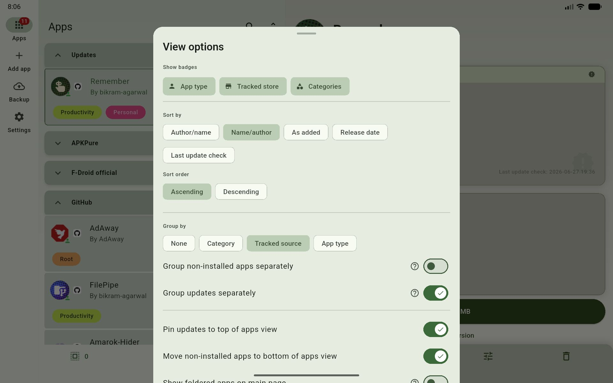
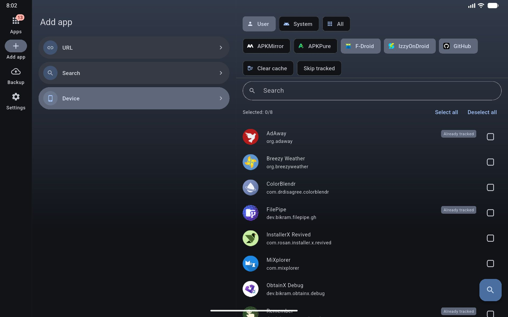
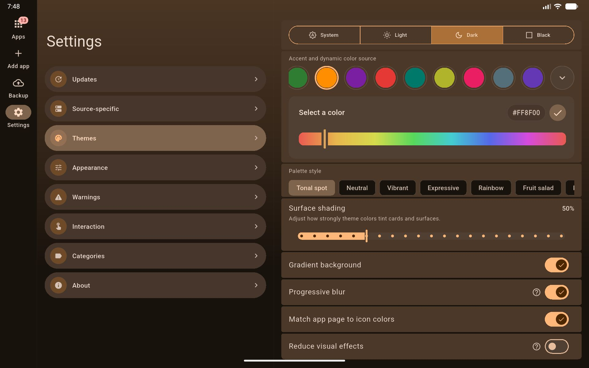

# ObtainX

ObtainX is a modern and supercharged fork of Obtainium. Re-engineered with a stunning Material 3 Expressive UI, it delivers an ultra-smooth interface packed with power-user utilities that make managing your Android apps effortless. 

> [!TIP]
> Curious how ObtainX stacks up against Obtainium? Check out my side-by-side [ObtainX vs Obtainium comparison](docs/Difference_with_Obtainium.md) featuring full interface screenshots.

<strong>Featured by HowToMen: Best Android Apps - May 2026! 🎊</strong>

  

## 📦 Installation

<!-- Coming soon. Placeholder code.

-->

## 🔄 Seamlessly bring your data from Obtainium

If you want to try out **ObtainX** without losing your current setup, you can bring your existing app list over in seconds:

- In Obtainium: Go to the `Import/Export` tab, click Export, and save the resulting .json file.
- In ObtainX: Go to the `Backup` tab, select Import, and choose that exact .json file.
- Continue where you left off: All your tracked apps and settings will be instantly populated.

## ✨ Unique Features

These features have been built from the ground up and do not exist in Obtainium.

### 🛡️ Security & Integrity

- **🛡️ Build Verification Checks** — Runs automated cryptographic checks (F-Droid/Izzy reproducible builds, GitHub Release Attestations) on apps you add to flag manipulated binaries before install. For total integrity, ObtainX's own updates are secured with GitHub Release Attestations as well. Learn more in the [Build Verification Guide](docs/build-verification-guide.md).

- **📦 Third-Party Installer Support** — Hand off updates to third-party installers like InstallerX or App Manager to review APK metadata (trackers, permissions, target SDK etc.) before installing (data hidden by stock installers). Essential for devices running under Google _Advanced Protection_.

### 🗂️ Smart Organization

- **📥 Bulk Import from Device** — Select any apps already on your phone and ObtainX automatically finds their sources on stores you choose. No URL hunting one by one.
- **🗂️ Dynamic Folders** — Group apps into folders manually or via automatic routing rules (by name, author, category, source etc.). Each folder retains its own layouts.
- **🕐 On-Demand Only mode** — Mark rarely updated apps so they're hidden from the main list and aren't checked during global update scans. Query them only on-demand.
- **👆 Configurable swipe gestures** — Left and right swipe actions are independently configurable per row. Choose from Update, Install, Pin, Edit, Delete, Open, App Info, or None. A color-coded icon hint appears during the drag so you always know what will happen.
- **↩️ Undo after delete** — Revert accidental app removals instantly via a 5-second toast notification.
- **🖼️ Custom app icons** — Not happy with an app's icon or a blank placeholder? Tap the icon on any app's detail page to set your own — pick from your gallery or grab one from the web.
- **🔍 Verified "also available on" store links** — Each app detail page shows a list of other stores (beside the one you are tracking) where the app is available. Only confirmed-present stores are shown. 

### 🚀 Advanced Update Controls

- **🧩 Advanced filter / RegEx Assist** — A built-in helper walks you through building regex filters on any field that supports them. No regex knowledge required. Full details in the [Additional options guide](docs/additional-options-guide.md).
- **⚖️ Know the update size beforehand** — See the exact download size for every update - across supported stores - before you even hit the update button.
- **⏭️ Skip Version** — Skip a specific release you don't want without marking the app as "updated." The next release will still show up normally.
- **🛑 Stop download** — You can stop any ongoing download from the app, the notification, or the update queue.
- **💾 Save assets** — Option to automatically save update assets (e.g. APKs) to your chosen folder, during update process itself.

## 🔧 Enhanced Features

Optimizations made to legacy Obtainium features.

- **🏪 APKMirror updates** — In Obtainium, the update button is completely disabled for APKMirror apps. ObtainX enables it and takes you directly to the specific release page for the new version. (Bulk Import is also supported.)

- **🧠 Smarter version status** — ObtainX handles harmless version label differences more intelligently, so you're only notified when there's genuinely something new. Six distinct states instead of a binary "update / up to date" pair: *up to date*, *update available*, *device is ahead*, *same version shown differently*, *genuinely unclear* and *Not installed*.

- **🎯 Add App — three paths, one screen** — URL, Search, and From Device are all on one screen under a segmented control. Search results load inline alongside store chips — no floating sheets, no separate screens. New searches can be started without needing to go back-n-forth. 

- **🔭 Track-only source improvements** — Shows installed version from the device when the package ID is known. The Update button opens the concrete release page, not just the app listing. In Obtainium, if the wrong package ID is fetched (or none at all), the app shows as "not installed" forever and update notifications never work right — with no way to fix it. ObtainX surfaces this clearly and lets you **edit the package ID directly from the app page**, instantly restoring correct install detection and update tracking.

- **🔖 Active filter chips** — Extends Obtainium's filter with dismissible chips pinned below the toolbar showing every active non-text filter (category, pinned, installed state, etc.). Tap any chip to clear just that filter. The row disappears entirely when nothing is active.

- **🏷️ Category customization** — More control over your categories: instead of cycling between a few random colors, pick any color of your choice. Category colors are WYSIWYG. Category's name switches between black and white text automatically for readability. You can also rename an existing category, and all assigned apps automatically receive it. Bulk edit lets you assign new categories to your selected apps, without wiping all existing ones. 

## 🎨 UI & UX

- **Adaptive tablet, foldable & landscape layout** — On large screens ObtainX switches to a true two-pane experience instead of just stretching the phone UI: a side **navigation rail** replaces the bottom bar, and your app list sits **side-by-side with the app's detail page**, so tapping a row (or editing it) opens it in place rather than pushing a full screen. Adding and bulk-importing apps split into a list/preview layout too — and those screens adapt in **landscape** as well, so big phones and unfolded foldables benefit, not just tablets.

- **Material 3 Expressive throughout** — Full M3 Expressive treatment across every screen: cards, fluid animations, expressive sliders, FAB and controls that feel like one product.

- **Total Customization** — You control the theme (system, light, dark, AMOLED), color (Material you, presets or any HEX), palette, color shading intensity, gradient, progressive blur, roundness of UI corners, UI scale etc. It's not just an afterthought - it's a full blown theme engine. Make it yours. 

- **Per-app color theming** — Each app's detail page derives its color scheme from the app's own icon. Deep, accurate, and dark-mode safe. Toggle *Match app page to icon colors* in Settings.

- **Hero icon transition** — Tapping an app row animates its icon smoothly into the detail page. Swipe back and it returns the same way.

- **Rich, Customizable App Rows** – See app type, tracking source, and category tags at a glance. Choose between full text badges or minimal stacked color strips to keep your list clean and uncluttered.

- **Richer app list grouping** — Group by source, app type (user/system/privileged), or non-installed split; a dedicated "Updates" group can float apps with available updates to the top independent of the active grouping mode.

- **Inline collapsible search** — A search icon sits in the Apps header. Tap it and a full-width field slides open with the keyboard ready and the list filtering live as you type.

- **Inline edit on detail page** — Edit an app's tracking settings directly from its detail page. An unsaved-changes guard prevents accidental data loss on back.

- **View options on Apps tab** — Grouping, sort order, and other organization controls live on the Apps tab itself so you can tune the list and see the result immediately.

- **Auto-hide action bars** — Action bars step out of the way when you're focused on content, giving you more screen space automatically.

- **Settings and form options in cards** — Related settings and per-app options are grouped into labeled cards. Much easier to scan than a single wall of options.

---

## 🖼️ Screenshots

<table>
<tr>
<td width="33%" align="center" valign="top">
 
</td>
<td width="33%" align="center" valign="top">
 
</td>
<td width="33%" align="center" valign="top">
 
</td>
</tr>

<tr>
<td width="33%" align="center" valign="top">
 
</td>
<td width="33%" align="center" valign="top">
 
</td>
<td width="33%" align="center" valign="top">
 
</td>
</tr>

<tr>
<td width="33%" align="center" valign="top">
 
</td>
<td width="33%" align="center" valign="top">
 
</td>
<td width="33%" align="center" valign="top">
 
</td>
</tr>
</table>

<table>
<tr>
<td width="50%" align="center" valign="top">
 
</td>
<td width="50%" align="center" valign="top">
 
</td>
</tr>

<tr>
<td width="50%" align="center" valign="top">
 
</td>
<td width="50%" align="center" valign="top">
 
</td>
</tr>
</table>

## 🎥 Screenrecords

<table>
<tr>
<td width="33%" align="center" valign="top">
<video src="https://github.com/user-attachments/assets/de3c59fe-fae3-4177-bb09-473d16065384" width="300" controls muted></video>
</td>
<td width="33%" align="center" valign="top">
<video src="https://github.com/user-attachments/assets/24e726cc-b8cf-40c2-a9fc-b5b0e024300b" width="320" controls muted></video>
</td>
<td width="33%" align="center" valign="top">
<video src="https://github.com/user-attachments/assets/3fb396db-0bd3-40e4-a1e9-a250a2c39aa6" width="320" controls muted></video>
</td>
</tr>
</table>

## Original Obtainium

ObtainX is a fork of Obtainium, licensed under [GPL-v3](LICENSE.txt). 

Read the original Obtainium [README here](https://github.com/ImranR98/Obtainium/blob/main/README.md).
