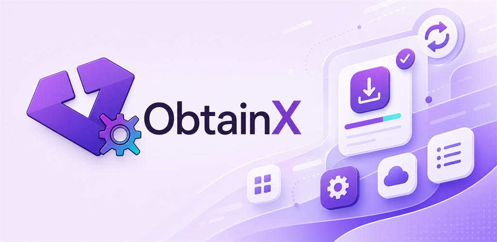
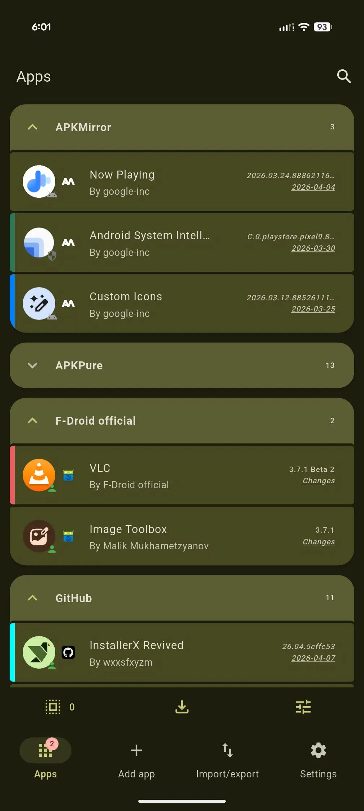
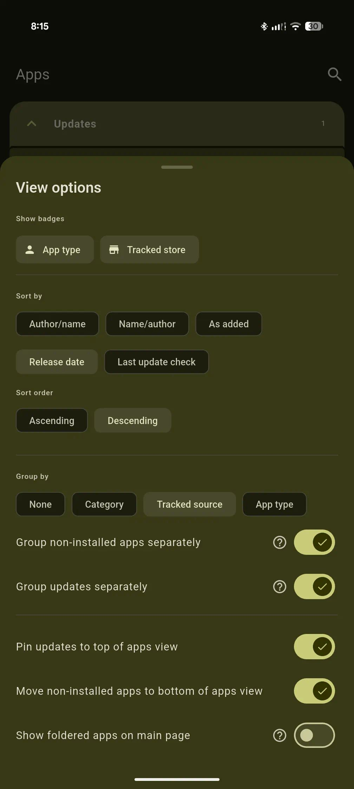
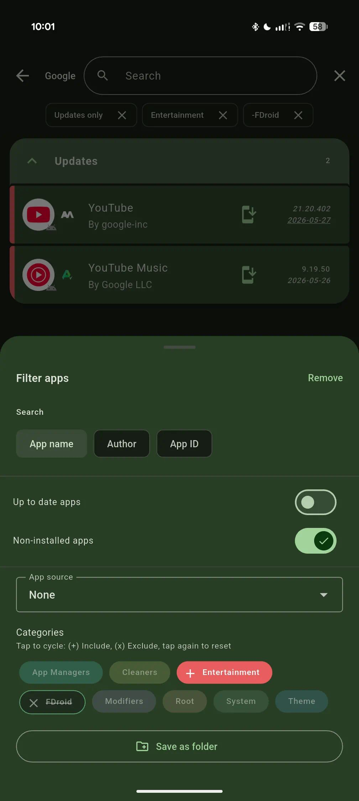
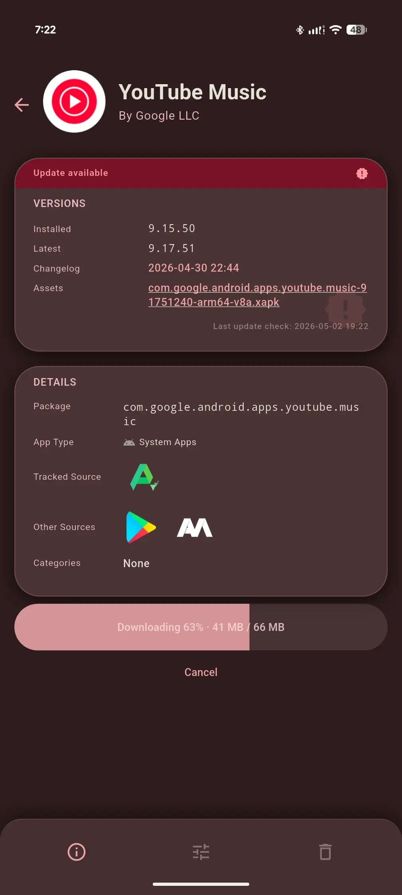
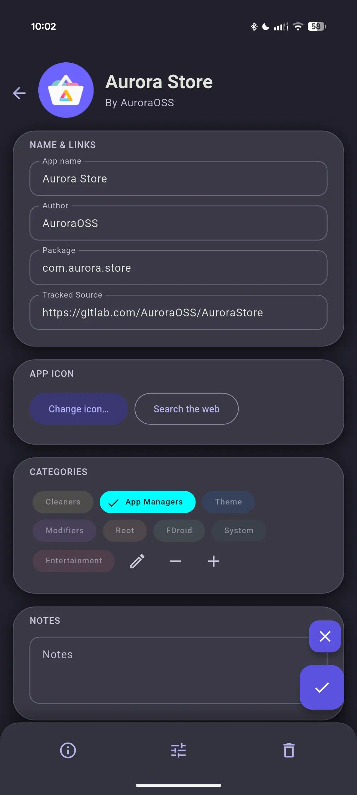
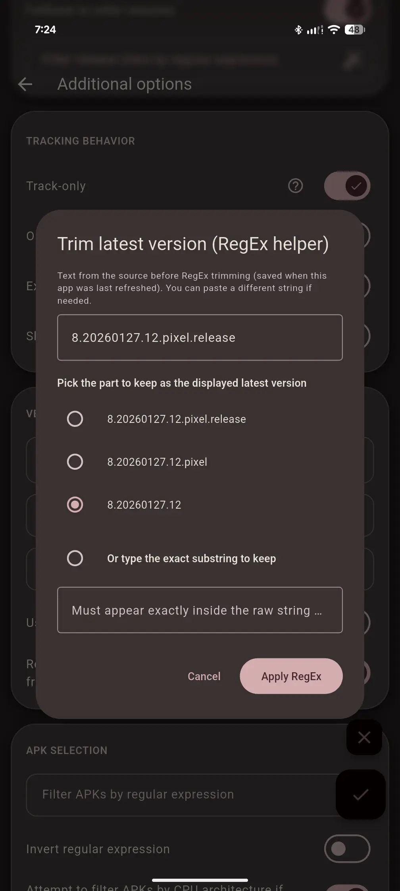
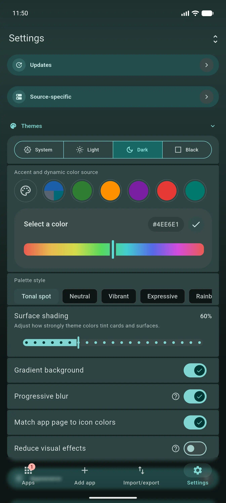
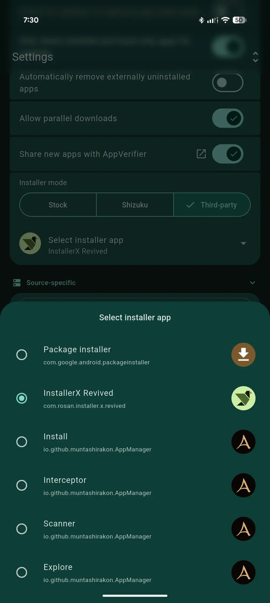
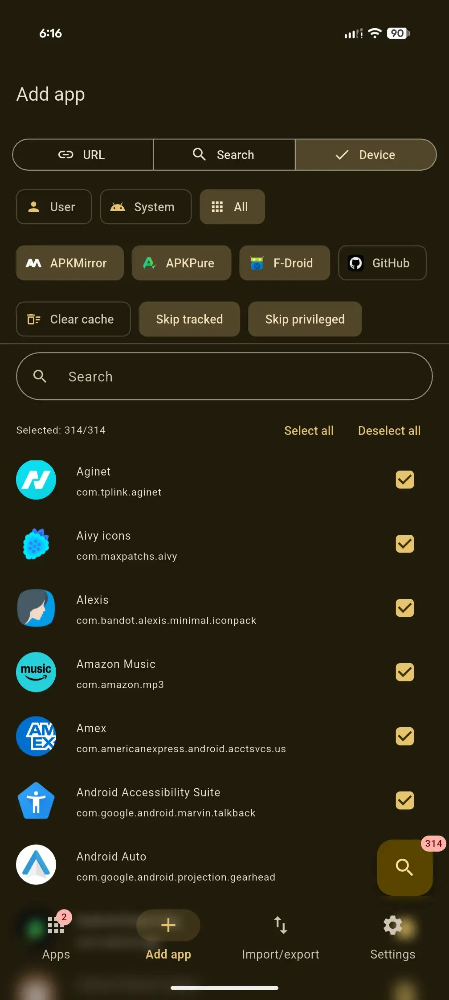

# ObtainX

ObtainX builds on everything Obtainium does well — same sources, same trust model, same spirit — with a reworked UI and a set of features aimed at making everyday use a little smoother. For a side-by-side comparison with screenshots, see [ObtainX vs Obtainium](./docs/Difference_with_Obtainium.md).

<strong>Featured by HowToMen: Best Android Apps - May 2026! 🎊</strong>

  

## ✨ New Features

Features that don't exist in Obtainium at all.

- **📥 Bulk Import from Device** — Select any apps already on your phone and ObtainX automatically finds their sources on stores you choose. No URL hunting, one by one.

- **📦 Installer choice** — A **Third-Party** install path lets you send APKs to any installer you trust (InstallerX, App Manager, etc.). Particularly useful when you can't grant "install unknown apps" to normal apps — for example, under _Advanced Protection_ — but a privileged installer can still do the job.

- **🕐 On-Demand Only mode** — Mark an app so it's hidden from the main list and only checked when you explicitly open it. Keeps your main list clean if you have apps you rarely update.

- **📁 Folders** — Create named folders to organise your app list. Apps in a folder are hidden from the main list to keep it decluttered. Folders can auto-assign apps via a rule (match by name, author, package ID, category, or source) or accept manual assignment via long-press. Each folder remembers its own view settings independently.

- **👆 Configurable swipe gestures** — Left and right swipe actions are independently configurable per row. Choose from Update, Install, Pin, Edit, Delete, Open, App Info, or None. A color-coded icon hint appears during the drag so you always know what will happen.

- **🖼️ Custom app icons** — Not happy with an app's icon or a blank placeholder? Tap the icon on any app's detail page to set your own — pick from your gallery or grab one from the web.

- **⚖️ Know the update size beforehand** — See the exact download size for every update - across supported stores - before you even hit the update button.

- **⏭️ Skip Version** — Pass on a specific release you don't want without marking the app as "updated." The next release will still show up normally.

- **🧩 Advanced filter / RegEx Assist** — A built-in helper walks you through building regex filters on any field that supports them. No regex knowledge required. Full details in the [Additional options guide](./additional-options-guide.md).

- **↩️ Undo after delete** — Swipe-to-delete and bulk-delete both show a 5-second **Undo** snackbar. Tap it and the app is fully restored.

- **💾 Save assets** - Option to save update assets (e.g. APKs) to your chosen folder, during update process itself.

## 🔧 Enhanced Features

Features Obtainium has, extended or improved here.

- **🏪 APKMirror updates** — In Obtainium, the update button is completely disabled for APKMirror apps. ObtainX enables it and takes you directly to the specific release page for the new version. (Bulk Import is also supported.)

- **🔍 Verified "also available on" store links** — Each app detail page shows a list of other stores (beside the one you are tracking) where the app is available. Only confirmed-present stores are shown. 

- **🧠 Smarter version status** — ObtainX handles harmless version label differences more intelligently, so you're only notified when there's genuinely something new. Six distinct states instead of a binary "update / up to date" pair: *up to date*, *update available*, *device is ahead*, *same version shown differently*, *genuinely unclear* and *Not installed*.

- **🎯 Add App — three paths, one screen** — URL, Search, and From Device are all on one screen under a segmented control. Search results load inline alongside store chips — no floating sheets, no separate screens. New searches can be started without needing to go back-n-forth. 

- **🔭 Track-only source improvements** — Shows installed version from the device when the package ID is known. The Update button opens the concrete release page, not just the app listing. In Obtainium, if the wrong package ID is fetched (or none at all), the app shows as "not installed" forever and update notifications never work right — with no way to fix it. ObtainX surfaces this clearly and lets you **edit the package ID directly from the app page**, instantly restoring correct install detection and update tracking.
- **📏 APK size on the button** — For GitHub apps, the Update or Install button shows the file size right in the label (e.g. "Update · 43 MB") once a version check has run. During the download, the progress label expands to "Downloading 45% · 19 / 43 MB" for any source that provides a Content-Length header.

- **🔖 Active filter chips** — Extends Obtainium's filter with dismissible chips pinned below the toolbar showing every active non-text filter (category, pinned, installed state, etc.). Tap any chip to clear just that filter. The row disappears entirely when nothing is active.

- **🏷️ Category customization** — More control over your categories: instead of cycling between a few random colors, pick any color of your choice. Category colors are WYSIWYG. Category's name switches between black and white text automatically for readability. You can also rename an existing category, and all assigned apps automatically receive it. Bulk edit lets you assign new categories to your selected apps, without wiping all existing ones. 

## 🎨 UI & UX

- **Material 3 Expressive throughout** — Full M3 Expressive treatment across every screen: cards, fluid animations, expressive sliders, FAB and controls that feel like one product.

- **Total Customization** — Beyond Material You: 9 preset colors and 9 palette algorithms. Enter your own custom hex accents. Choice of gradient background and progressive blurs.

- **Per-app color theming** — Each app's detail page derives its color scheme from the app's own icon. Deep, accurate, and dark-mode safe. Toggle *Match app page to icon colors* in Settings.

- **Hero icon transition** — Tapping an app row animates its icon smoothly into the detail page. Swipe back and it returns the same way.

- **App Type and store badges on every row** – Small icons on each app row shows the app type (User, System, Priviledged) and where it's tracked (GitHub, GitLab, F-Droid, APKMirror, and more), so you know at a glance without opening the app. (Configurable. You can turn it off.)

- **Richer app list grouping** — Group by source, app type (user/system/privileged), or non-installed split; a dedicated "Updates" group can float apps with available updates to the top independent of the active grouping mode.

- **🏷️ Source favicon badges** — Every app row shows a small favicon identifying where it's tracked — GitHub, GitLab, F-Droid, APKMirror, and more — without opening the app.

- **Inline collapsible search** — A search icon sits in the Apps header. Tap it and a full-width field slides open with the keyboard ready and the list filtering live as you type.

- **Inline edit on detail page** — Edit an app's tracking settings directly from its detail page. An unsaved-changes guard prevents accidental data loss on back.

- **Theme & view controls on Apps tab** — Density, sort order, and visual theme live on the Apps tab itself so you can tune the list and see the result immediately.

- **Auto-hide action bars** — Action bars step out of the way when you're focused on content, giving you more screen space automatically.

- **Settings and form options in cards** — Related settings and per-app options are grouped into labeled cards. Much easier to scan than a single wall of options.

---

## 🖼️ Screenshots

<table>
<tr>
<td width="33%" align="center" valign="top">
 
</td>
<td width="33%" align="center" valign="top">
 
</td>
<td width="33%" align="center" valign="top">
 
</td>
</tr>

<tr>
<td width="33%" align="center" valign="top">
 
</td>
<td width="33%" align="center" valign="top">
 
</td>
<td width="33%" align="center" valign="top">
 
</td>
</tr>

<tr>
<td width="33%" align="center" valign="top">
 
</td>
<td width="33%" align="center" valign="top">
 
</td>
<td width="33%" align="center" valign="top">
 
</td>
</tr>
</table>

## 🎥 Screenrecords

<table>
<tr>
<td width="33%" align="center" valign="top">
<video src="https://github.com/user-attachments/assets/de3c59fe-fae3-4177-bb09-473d16065384" width="300" controls muted></video>
</td>
<td width="33%" align="center" valign="top">
<video src="https://github.com/user-attachments/assets/24e726cc-b8cf-40c2-a9fc-b5b0e024300b" width="320" controls muted></video>
</td>
<td width="33%" align="center" valign="top">
<video src="https://github.com/user-attachments/assets/3fb396db-0bd3-40e4-a1e9-a250a2c39aa6" width="320" controls muted></video>
</td>
</tr>
</table>

## 🔄 Seamlessly bring your data from Obtainium

If you want to try out **ObtainX** without losing your current setup, you can bring your existing app list over in seconds:

- In Obtainium: Go to the Import/Export tab and select Export. This will generate a .json file of your current tracked apps.

- In ObtainX: Open the app, navigate to the Import/Export section, and select Import. Then select that .json file.

- Continue where you left off: All your tracked apps and settings will be instantly populated.

## Original Obtainium

Read the original Obtainium [README here](https://github.com/ImranR98/Obtainium/blob/main/README.md).
