# ObtainX vs Obtainium – what's different and why it matters

## UI comparisons

**Material 3 Expressive everywhere** – Full M3 Expressive treatment across every screen: cards, motion, sliders, and controls that feel like one coherent product across your app list, app details, adding apps, and settings.

### Your apps list – cards, grouping, and swipe gestures

The main list is where you live. ObtainX rebuilt it around **clarity and speed** with a full **Material 3 Expressive** treatment: apps grouped into cards by category, smarter grouping options (by source, non-installed apps separated out), and a search bar that opens inline and filters the list live as you type. Every row supports **configurable swipe actions** – update, install, pin, edit, delete, open, and more – so common tasks are always a swipe away. The dynamic action bar shows only what's relevant at any point.

<table>
<tr>
<td width="50%" align="center" valign="top">
 <strong>Obtainium</strong>
</td>
<td width="50%" align="center" valign="top">
 <strong>ObtainX</strong>
</td>
</tr>
</table>

- Card UI per category; stronger grouping options (by source, non-installed split out).
- Collapsible search in the top bar — expands to a full bar with live list filtering.
- Configurable per-row swipes: edit, update, delete, pin, and more.
- Each app row shows the source store badge
- Dynamic action bar - controls appear only when they make sense. 

### Filters – type and watch the list breathe

**Live search and filters** mean zero guesswork. The list reshapes as you type, and the filter sheet keeps the rest of the UI visible so you never lose your bearings. Fast, readable, and you always see your apps and the filters at the same time.

<table>
<tr>
<td width="50%" align="center" valign="top">
 <strong>Obtainium</strong>
</td>
<td width="50%" align="center" valign="top">
 <strong>ObtainX</strong>
</td>
</tr>
</table>

- List updates live as you type — no need to confirm or submit.
- Filter sheet slides up over the app list, keeping context visible behind it.
- Save the filter as folder that dynamically updates. 

### Themes and view options – on the Apps tab, where you use them

Theme and view controls live on the Apps tab itself, so you can switch density, sorting, or look while you're still looking at your apps and see the change happen instantly. Obtainium keeps these under Settings tab, so you have to keep tapping back-n-forth; ObtainX surfaces them closer to where you'd reach for them.

<table>
<tr>
<td width="50%" align="center" valign="top">
 <strong>Obtainium</strong>
</td>
<td width="50%" align="center" valign="top">
 <strong>ObtainX</strong>
</td>
</tr>
</table>

- Theme and layout choices are on the Apps tab — tweak and see the result immediately.
- Extra customization options like "Group by App Type", Show badges for app type and tracked store, Group updates separately etc.

### App detail – verdict first, beauty that scales

The detail screen is a **showpiece**: a smooth icon animation during transition, page colors drawn from the app's own icon, and information laid out in clear sections so it is easy to parse. The header states the **version verdict** prominently — including nuanced states beyond a simple "update available" or "up to date." Timestamps are clean and readable. Store shortcut buttons show where else the app is **confirmed to be available** — ObtainX verifies each store (including a live Play Store check) rather than showing speculative links. Results are cached so the page is instant on repeat views, and a pull-to-refresh on the main list quietly checks any app that hasn't been scanned yet. Only categories you've assigned appear, keeping the page uncluttered. A well-balanced bottom bar keeps all actions within thumb reach. **Skip version** lets you pass on a release you don't want without marking it as installed. **Edit in place** so you can change app details without backing out of the page. You can also change each app's icon.

<table>
<tr>
<td width="50%" align="center" valign="top">
 <strong>Obtainium</strong>
</td>
<td width="50%" align="center" valign="top">
 <strong>ObtainX</strong>
</td>
</tr>
</table>

- Smooth icon animation; page colors drawn from the app's icon.
- Grouped info cards; clear version verdict right at the top.
- More verdict states — not just "update" or "up to date."
- **Skip version** for updates you don't want. 
- Cleaner timestamps; verified links to other stores (APKMirror, F-Droid, APKPure, Play Store — only shown when confirmed present, cached for instant repeat views); only your assigned categories shown.
- Edit the app directly from this page.
- Options to change app icon.
- See the update file size right in the update button, before or during the download (for supported stores). 

### Adding apps – one screen, three paths

You add apps in **one place** with three tabs along the top: **URL** (paste a link), **Search** (look across stores), or **From Device** (bulk-add apps from your phone). Every step uses the full height so lists and buttons are easy to see and tap.

- Three clear ways to add apps — all on one screen, no navigation needed.

### Adding apps – paste a link

Instead of one long wall of options, settings are grouped into **separate boxes** with clear headings. For any field where RegEx filters can be used, a **built-in helper** walks you through building the filter — no prior knowledge required.

<table>
<tr>
<td width="50%" align="center" valign="top">
 <strong>Obtainium</strong>
</td>
<td width="50%" align="center" valign="top">
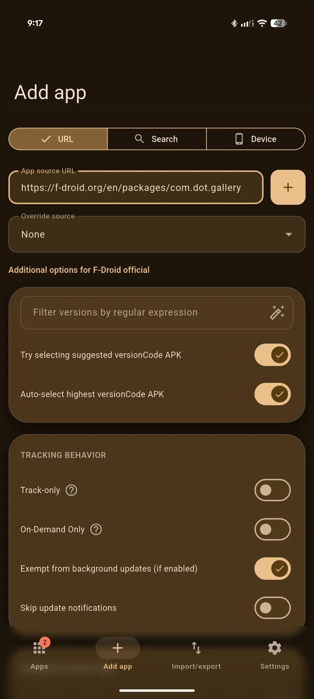 <strong>ObtainX</strong>
</td>
</tr>
</table>

- **Grouped options** — related settings stay together, so the screen scans quickly.
- **Built-in filter helper** — build advanced filters without knowing the syntax.

### Adding apps – search across stores

Everything happens on one page. All stores are visible from the start. Tap Search and results load right there — no separate popups or screens to step through. Each result shows a small store badge so you always know where a result came from. Want to try a different store? Just tap it above and search again. Results replace inline, no backing up needed.

<table>
<tr>
<td width="50%" align="center" valign="top">
 <strong>Obtainium</strong>
</td>
<td width="50%" align="center" valign="top">
 <strong>ObtainX</strong>
</td>
</tr>
<tr>
<td width="50%" align="center" valign="top">
 <strong>Obtainium</strong>
</td>
<td width="50%" align="center" valign="top">
 <strong>ObtainX</strong>
</td>
</tr>
</table>

- All stores visible upfront — pick one, search, and see results on the same page.
- Store badge on each result so you know at a glance where it comes from.
- Switch store and search again without navigating away.

### Settings – cards, hierarchy, expressive controls

Settings gets the **same card-based layout** as the rest of the app: related options grouped together, visually distinct from neighboring sections. Easier to scan, easier to find the thing you're looking for. **Material 3 Expressive** sliders and controls throughout.

<table>
<tr>
<td width="50%" align="center" valign="top">
 <strong>Obtainium</strong>
</td>
<td width="50%" align="center" valign="top">
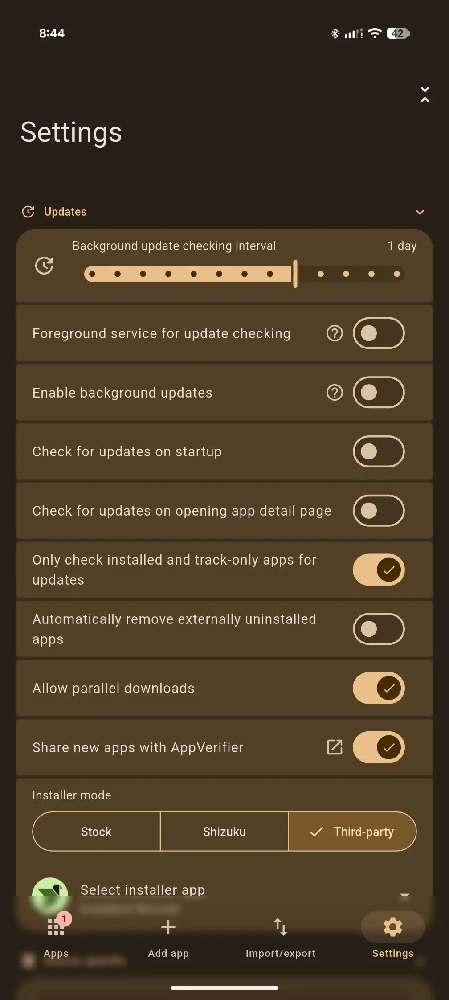 <strong>ObtainX</strong>
</td>
</tr>
</table>

- Settings organized into logical cards — much easier to scan and navigate.
- Material 3 Expressive sliders and controls throughout.

---

## Clearer app statuses

ObtainX surfaces **finer-grained states** rather than forcing every situation into a binary "update / up to date" answer.

<table>
<tr>
<td width="50%" align="center" valign="top">
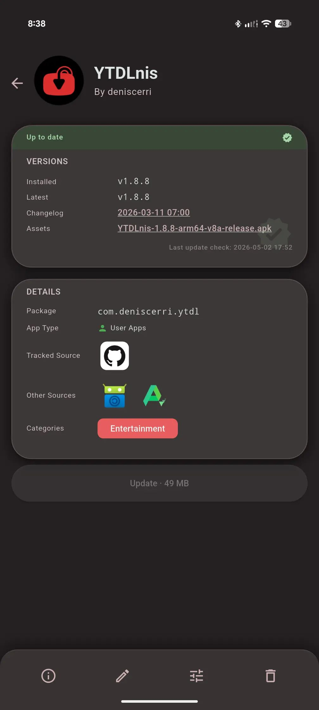 
<strong>Up to date</strong> 
What's on your device matches what the source is offering — you're current.
</td>
<td width="50%" align="center" valign="top">
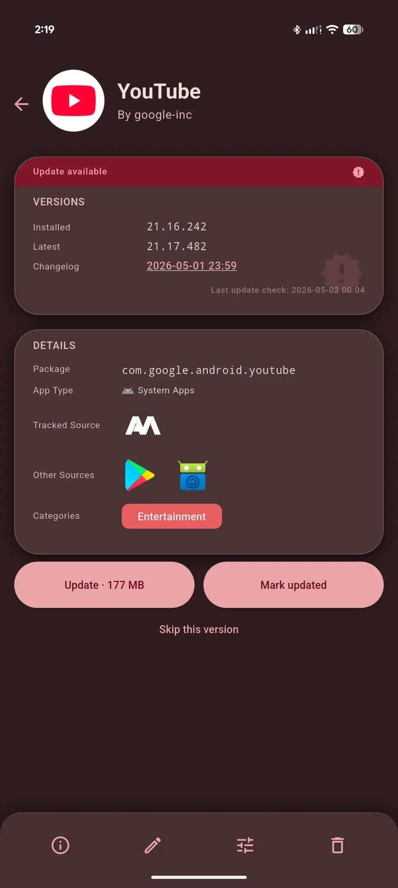 
<strong>Update available</strong> 
The source has a newer version than what's installed — time to update.
</td>
</tr>
<tr>
<td width="50%" align="center" valign="top">
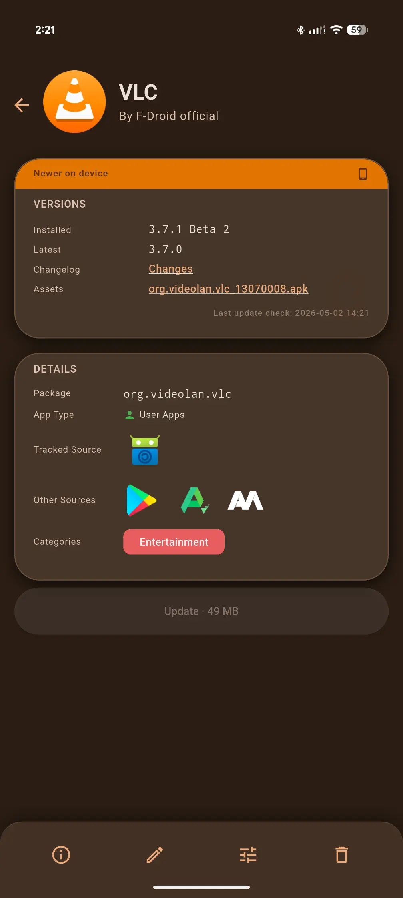 
<strong>Device has a higher version</strong> 
Your installed version is ahead of what the source advertises. Common with betas, sideloads, or sources that lag behind the actual release — shown correctly rather than flagged as a false update.
</td>
<td width="50%" align="center" valign="top">
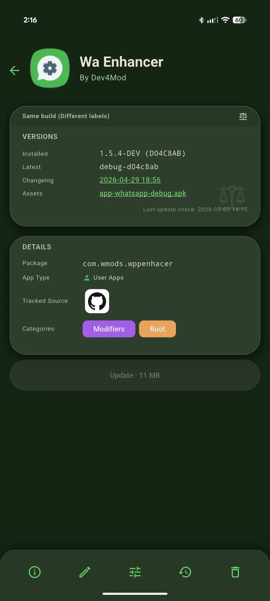 
<strong>Same version, shown differently</strong> 
The version is the same, but the text from the source and from Android don't match exactly. ObtainX recognizes this and doesn't send you chasing an "update" that isn't really one.
</td>
</tr>
<tr>
<td width="50%" align="center" valign="top">
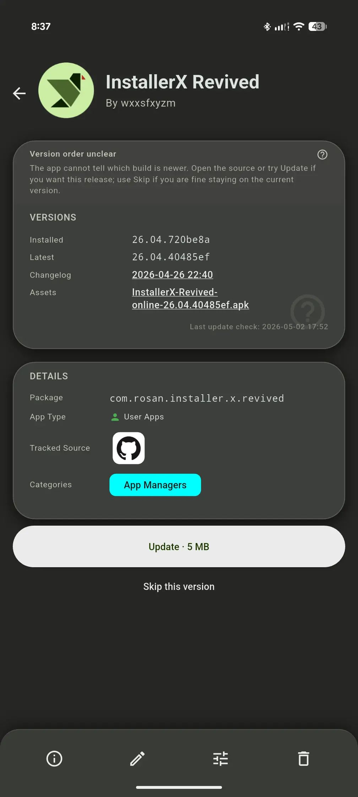 
<strong>Genuinely unclear</strong> 
Sometimes two versions can't be fairly compared — for example when a developer labels releases with commit hashes instead of version numbers. Rather than guessing, ObtainX says so and lets you check for yourself or skip it.
</td>
<td width="50%" align="center" valign="top">
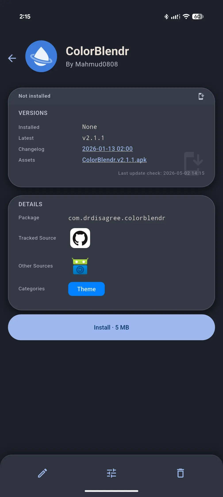 
<strong>App not installed</strong> 
This app is currently not installed on you device. Tip: if ObtainX somehow fetched a wrong package id when you added the app, that will cause it say "App not installed". In that case, you can click edit and fix the package id. 
</td>
</tr>
</table>

---

## Why this fork exists — installer choice

> **This is the feature that started everything.**

Obtainium installs APKs itself, through the standard Android package installer. That's fine for most people — but there are two very different reasons you might want something else.

**Reason 1: You care about what you're installing.**

Third-party installers like [InstallerX](https://github.com/MuntashirAkon/InstallerX) show you things the stock installer doesn't: the APK's version number, its minimum and target API levels, whether those levels changed from your currently installed version, and a range of install options the standard path simply doesn't expose. [App Manager](https://github.com/MuntashirAkon/AppManager) goes further and surfaces any trackers bundled in the APK before you commit to installing it. If you want to know what you're actually installing rather than just tapping through a system dialog, these tools give you that visibility — whcich you can't use via Obtainium.

**Reason 2: Advanced Protection blocks sideloading.**

Android's Advanced Protection mode is one of the strongest security configurations available. Among other things, it restricts the standard sideload install path that Obtainium uses. So every update becomes a three-step routine:

1. Disable Advanced Protection
2. Install the update
3. Re-enable Advanced Protection

Step three is easy to forget. Your phone silently sits in a weaker state until you remember.

InstallerX and similar tools can be granted elevated install permissions via root or ADB, allowing them to install APKs even with Advanced Protection active. They're purpose-built for exactly this — but Obtainium had no way to hand off to them.

**ObtainX solves both.** You pick your installer. ObtainX fetches the APK and passes it to whichever installer you've configured. You get the visibility and control of a proper installer tool, and Advanced Protection stays on.

A pull request with this feature was submitted to Obtainium — it hasn't been merged yet. While waiting, there were other rough edges worth fixing. Then a few more. That compounding list of improvements is what became ObtainX.

---

## Bulk add apps

> **This is the feature that makes ObtainX worth switching to.**

Obtainium let you add apps by searching by name — pick a store, search, pick from results. That works fine for one app. But if you want to track 50 apps, you do that 50 times. 100 apps? 100 times. There's no shortcut.

ObtainX has the shortcut.

**Tap Device. Select your apps. Hit scan. Done.**

ObtainX reads every app installed on your device, searches each of your chosen stores in turn — APKMirror, APKPure, F-Droid, GitHub — and comes back with a ready-to-go list of what it found and where. The whole thing — scanning 200 apps across four stores — takes a few minutes and zero manual effort. You can add your entire library in one shot.

<table>
<tr>
<td width="50%" align="center" valign="top">
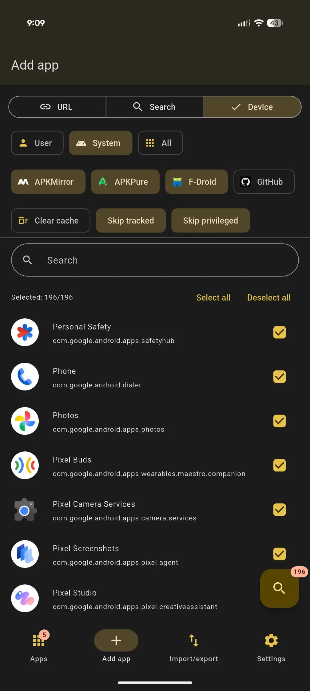 
<strong>Select</strong> Filter by app type, pick your stores, toggle Skip tracked / Skip privileged, search, select all or hand-pick.
</td>
<td width="50%" align="center" valign="top">
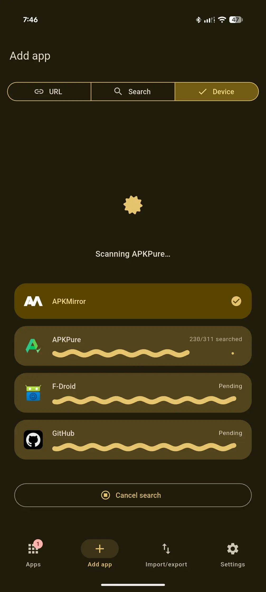 
<strong>Scan</strong> Stores are searched, with live per-store progress. Results are cached — repeat scans skip what's already known.
</td>
</tr>
<tr>
<td width="50%" align="center" valign="top">
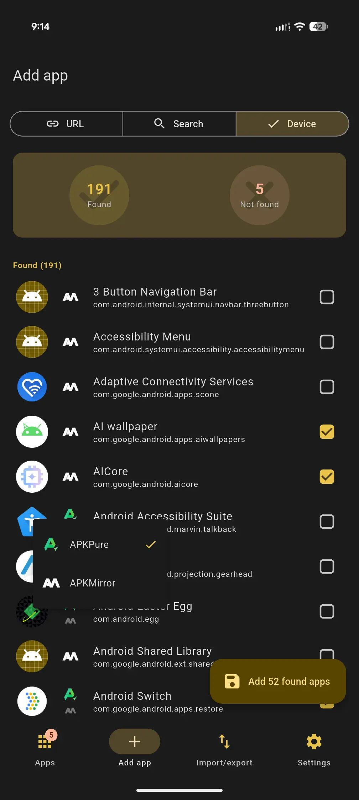 
<strong>Review</strong> Found / Not found summary at a glance. Each result shows which store(s) it was found on. Uncheck anything you don't want.
</td>
<td width="50%" align="center" valign="top">
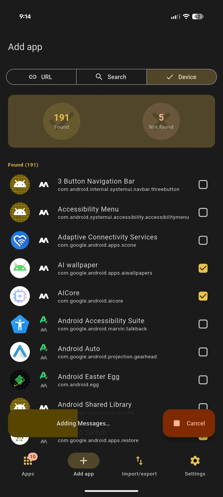 
<strong>Add</strong> Tap "Add N found apps." Live progress as they're added. Cancel any time.
</td>
</tr>
</table>

---

## Folders

Obtainium has one flat list. Once you're tracking 30+ apps it becomes hard to navigate — even with grouping, everything is on one page.

ObtainX adds **Folders**: persistent named views that pull apps off the main list and give them their own separate page, reacheable via button at the bottom of the Apps page. The main list shows only apps that don't belong to any folder, so it stays focused.

**How folders work:**
- **Rule-based** — Set a match rule (field: name, author, package ID, category, or source; match type: contains, equals, starts with; value: any text) and ObtainX auto-assigns every matching app to the folder, including any new apps you add later.
- **Manual** — Long-press one or more apps and tap the folder icon in the multi-select toolbar to assign them directly.
- **Mixed** — A folder can have a rule for new apps and still accept manual additions.
- **Exclusions** — If you manually remove an app from a rule-based folder, it's excluded and the rule won't re-add it. Manually adding it back clears the exclusion.
**Per-folder view settings** — Each folder (and the On-Demand Only page) remembers its own sort column, group-by mode, pinned state, and filter — completely independent from the main list and from each other.

---

## On-Demand Only

Obtainium checks every tracked app on its refresh schedule — every hour, every few hours, however you've set it. That's fine for most apps, but some you simply don't need polled constantly.

ObtainX lets you mark individual apps as **On-Demand Only**. Apps with this flag are completely skipped during automatic background refreshes. They live on their own dedicated special folder — always visible when you want them, never adding noise to your main update count when you don't. When you're ready to check one, you check it. Not before.

**Why it matters:**

- **Apps that rarely change** — Niche tools, archived apps, or anything that updates in a long while. No point waking your phone for them every hour.
- **Apps you want full control over** — If you prefer to audit what's being updated rather than letting the background refresh decide for you, move those apps here and update them deliberately.
- **Reduce background noise** — Fewer background checks means fewer notifications, less network use, and a quieter update count badge on the main list.

---

## More features worth knowing

Check out the [README](../README.md) doc for full list of extra fetures.
